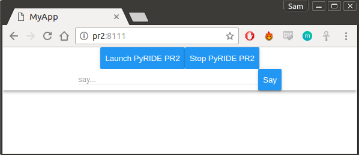

# REMI based web-GUI examples

Kinda useful example:

```
rosrun remi_examples example_activate_pyride.py
```

It will listen to port 8111, open browser at `http://pr2:8111`.

If accessing from a phone you'll need to acces via the robot IP instead of hostname.



